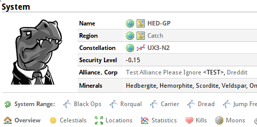

dotlan-sr
==============

A userscript for adding capital ship system range links to [dotlan](http://evemaps.dotlan.net/) system pages.

Installation
---------

Firefox users need to have the [Greasemonkey](https://addons.mozilla.org/en-US/firefox/addon/greasemonkey/) addon installed.
Chrome users do not need any other addons installed.

Navigate to the raw

    /dotlan-ser.user.js

file in this repository or [click here](https://github.com/stuartdb/dotlan-sr/raw/master/dotlan-sr.user.js) and it should install the script.

Todo
-------

At the moment the script only links to the navigation page for a Titan class ship piloted by a character with max jump skills.
I plan to add capital ship and skill selection in a future version.

License
-------

Dotlan-sr is released under the [MIT license](http://opensource.org/licenses/MIT)

